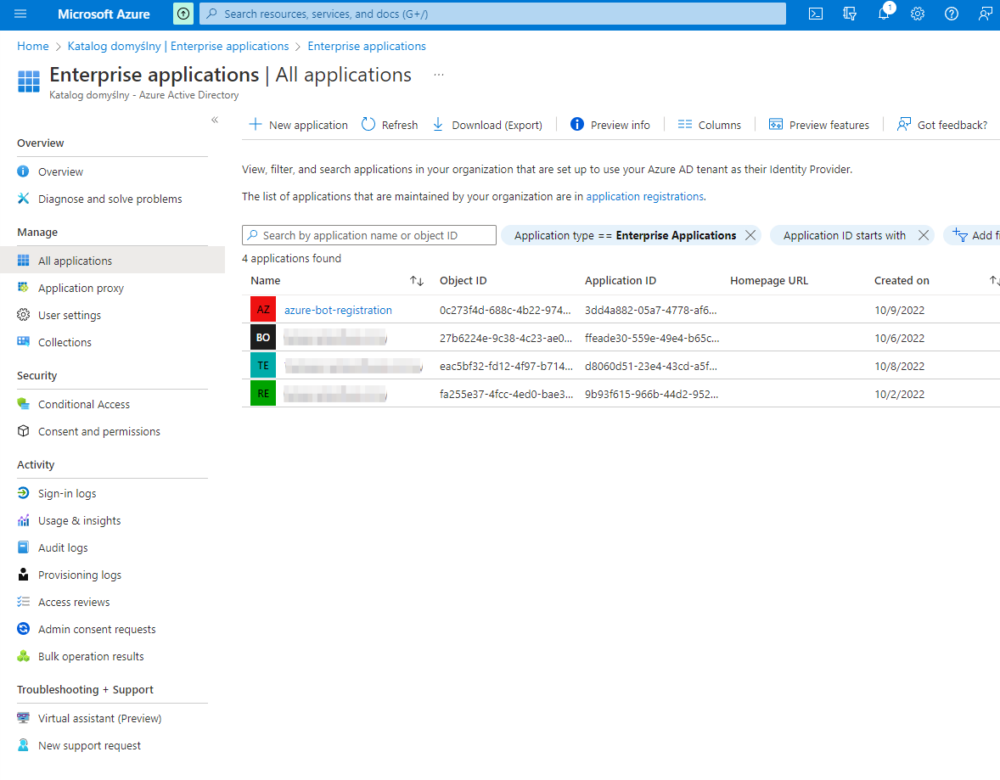
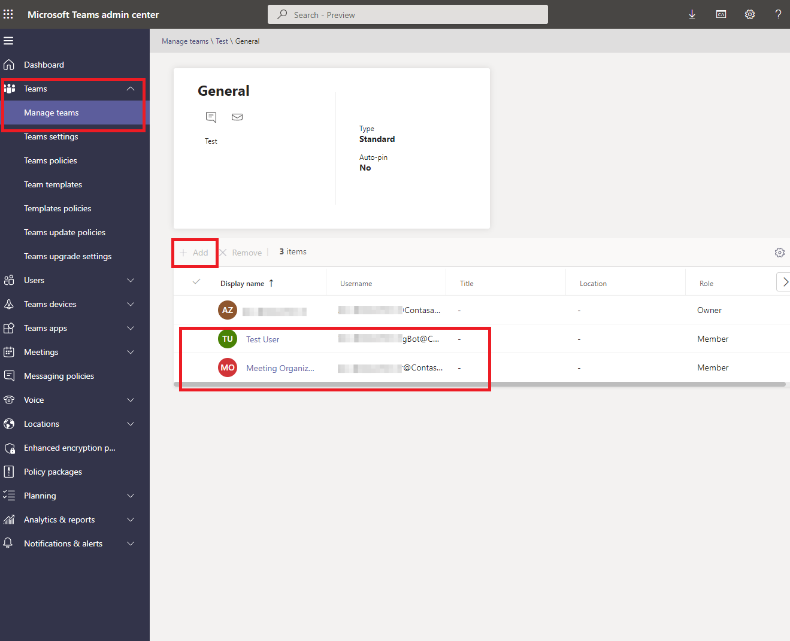
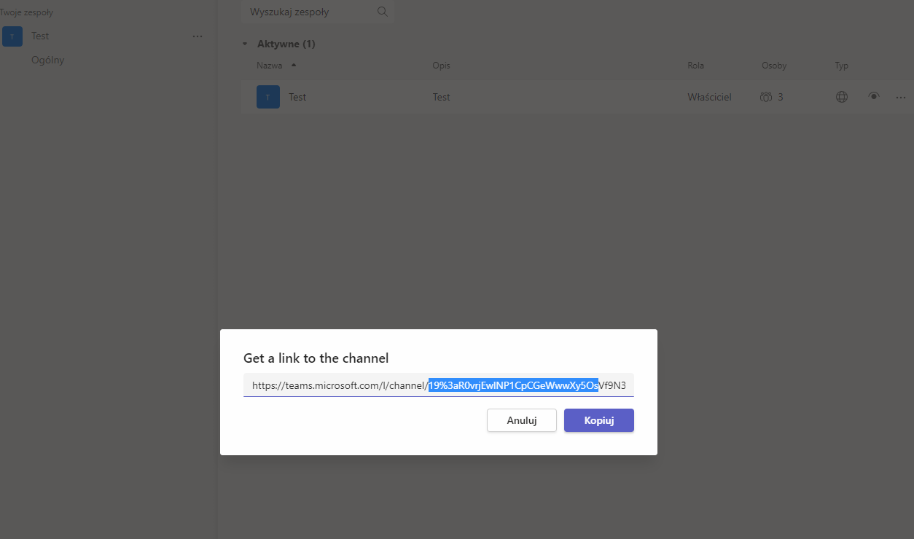
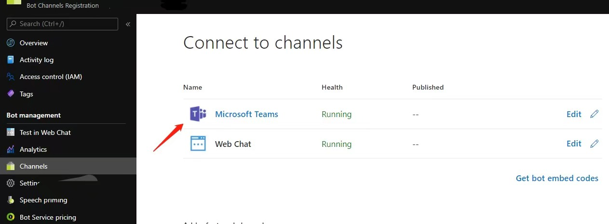

# Introduction

## Note

The system will load the bot and join it to appropriate calls and meetings in order for the bot to enforce compliance with the administrative set policy.
This sample is only designed for compliance recording scenario. Do not use it for any other scenarios.

## About

The Policy Recording bot sample guides you through building, deploying and testing a bot. This sample demonstrates how a bot can receive media streams for recording. Please note that the sample does not actually record. This logic is left up to the developer.

## Getting Started

This section walks you through the process of deploying and testing the sample bot.

### Prerequisites

* Install the prerequisites:
    * [Visual Studio 2017+](https://visualstudio.microsoft.com/downloads/)
    * [PostMan](https://chrome.google.com/webstore/detail/postman/fhbjgbiflinjbdggehcddcbncdddomop)

### Register your Office 365 organization account

This bot requires an Office 365 organization. Follow this guide to create one.

### Prepare cloud infrastructure

Part 1 - prepare domains and SSL certificate:

1. Create VM - it will be necessary to obtain a wildcard certificate. 
2. In your domain management tool (in our case google domains) connect your wildcard DNS record (in our example *.thefaze.de) with the VM IP address and your bot subdomain (ex. bot.thefaze.de) with the VM domain (ex. testbotrecorderservice1.northeurope.cloudapp.azure.com). 
   
   

3. On your VM generate a wildcard certificate (you can do it with [certbot](https://certbot.eff.org/)). Than download it and convert certificate format from .crt to .pfx with [OpenSSL](https://www.openssl.org/) tool. It will be used later.

Part 2 - prepare Azure infrastructure:

1. Create Azure Bot. Next, go to Channels => Microsoft Teams and enable calling and set webhook (with previously created domain ex. https://bot.thefaze.de/api/calling). Save your bot name for later configuration.
   
  

2. Create a Key Vault and import the SSL certificate created in part 1 in .pfx format. Copy the certificate thumbprint and save it for later. Then set the access principles.
   
  

  
   
3. Create Storage Account. Copy the blob service endpoint and access key and save it for later.
   
  

  
   
4. Register a new application in Azure Active Directory. Add new API Permissions -> Microsoft Graph and grant the administrator consent. Copy and save the application name, application id, and app secret.
   
  

  

  

5. Create user - save MeetingOrganizer user objectId. 

  

Part 3 - activate accounts in M365 Admin Center:

1. Navigate to https://admin.microsoft.com/ and next to Users => Active users.
2. Search for previously added users. Go to the Licenses and apps check the MS Teams app and click the "Turn on" button.
   
  


## Configuring an Application Instance 

Perform the following steps on your local machine. Open PowerShell (in admin mode) and run the following commands. When prompted for authentication, log in with the tenant admin.

### Authenticate teams in PowerShell
  * `Install-Module -Name MicrosoftTeams -Force -AllowClobber`
  * `Import-Module MicrosoftTeams`
  * `Connect-Microsoft Teams` - connect to teams with the Office 365 account

### Create an Access Policy and assign grant it to AAD (Azure Active Directory) user
  * `New-CsApplicationAccessPolicy -Identity {AccessPolicyName} -AppIds {"ApplicationID"} -Description {"Access Policy Description"}` - create an application access policy that contains your application ID's.
  * `Grant-CsApplicationAccessPolicy -PolicyName {AccessPolicyName} -Identity {UserObjectId}` - the Identity parameter is the ObjectId of the AAD User. This action can take 30 minutes to take effect!

### Create Application Instance
  * `New-CsOnlineApplicationInstance -UserPrincipalName {UserUPN} -DisplayName {UserDisplayName} -ApplicationId {ApplicationID}` - create application instance. UserUPN example: userUnderPolicy@example.com.This command will return the ObjectId of the Application Instance User. The ApplicationId parameter is the Application ID of the AAD App registrations. 
  * `Sync-CsOnlineApplicationInstance -ObjectId {UserObjectId}` -  The ObjectId parameter value will be obtained by the previous command.

### Create a compliance recording policy and assign it to the user
  * `New-CsTeamsComplianceRecordingPolicy -Enabled $true -Description {Policy Description} {ComplianceRecordingPolicyName}`
  * Set-CsTeamsComplianceRecordingPolicy -Identity {ComplianceRecordingPolicyName} -ComplianceRecordingApplications `@(New-CsTeamsComplianceRecordingApplication -Parent {ComplianceRecordingPolicyName} -Id {UserObjectId})
  * `Grant-CsTeamsComplianceRecordingPolicy -Identity {UserUPN} -PolicyName {ComplianceRecordingPolicyName}`

To verify your policy was assigned correctly:
  * `Get-CsOnlineUser {UserUPN} | ft sipaddress, tenantid, TeamsComplianceRecordingPolicy`

## Project cloud configuration
Switch to the source code folder path, execute the PS within the source code, and enter the settings project information
- cd {SourcePath}\CustomComplianceRecordingBot\Source
- .\configure_cloud.ps1
- Path: {SourcePath}\CustomComplianceRecordingBot\Source\BotService\LocalMedia\ComplianceRecordingBot
- Service DNS name: {DNS name}
- Service CName: {CName}
- Certificate thumbprint: {thumbprint}
- Bot Display Name: {Azure Bot Service Name}
- Bot's Microsoft application id: {Azure Bot Service application id}
- Bot's Microsoft application secret: {Azure Bot Service application secret}

### Teams configuration

1. Go to the [Teams Admin site](https://admin.teams.microsoft.com/). In Teams go to Manage Teams => channels. Select a channel and add previously created users. 

  

2. Open [teams](https://teams.microsoft.com/). Select a channel and click "Get a link to the channel". In the displayed link search for ".../channel/YOUR_CHANNEL_ID/..."

  

### Deploy
Publish the bot from VS:

Right-click PolicyRecordingBot, then click `Publish (extended support)`. 

Choose the correct Azure Subscription Publish it to the cloud service you created earlier.

### Test

1. Set up the test meeting and test clients:
   1. Sign in to Teams client with a non-recorded test tenant user.
   2. Use another Teams client to sign in with the recorded user. You could use an private browser window and open up https://teams.microsoft.com. If the call notification doesn't appear on web, use the Teams desktop client.

2. Place a call from the Teams client with the non-recorded user to the recorded user.

3. Your recording bot should receive the incoming call and join the call immediately. Use the recorded users' Teams client to accept the call. Once the P2P call is established, you'll see a banner indicating that the recording has started. See the next step to learn how you can retrieve the call log.
     

3. Interact with your service, _adjusting the service URL appropriately_.
    1. Get diagnostics data from the bot. Open the url https://bot.contoso.com:10101/calls in a browser for auto-refresh. Search for the most recent CallId and replace with it in the below url.
       * Active calls: https://bot.contoso.com:10101/calls/{CallId}
       * Service logs: https://bot.contoso.com:10101/logs

    2. Terminating the call through `DELETE`, as needed for testing. Replace the {CallId} below with your call id from the first response.

        ##### Request
        ```json
            DELETE https://bot.contoso.com/calls/{CallId}
        ```
### Frequently Asked Questions:

1. **Question**: Call was forwarded to voiceMail directly instead of calling.

    **Solution**: Make sure Microsoft Teams Channel is enabled under Bot Channels Registration.
    

2. **Question**: Answering incoming call notification taking too long resulting in call not found error.
    
    **Solution**: Policy Recording scenario has a rather small timeout window set to receive answer from the bot, in order to make sure user can have time to pick up the call after bot joins the call.
    Something to consider to improve the performance of answering incoming call:
    1. Make sure the AAD token used to authenticate outbound request is cached, instead of acquiring one everytime.
    2. Make sure the bot server is located in the same geo-region as the user.

3. **Question**: How to migrate to grouping mode?

    **Solution**:
    1. Answer the call with **participantCapacity** to specify the capacity of how many policy-based users this bot instance can handle as a group. If the bot passes null or a value of 0 or 1, it means that the bot does not support grouping. We expect the participantCapacity to be quite large, like 100 or more.
   ```csharp
   await ICall.AnswerAsync(mediaSession: mediaSession, participantCapacity: capacity);
   ```
    2. Handle user joining in same group by hooking **ParticipantJoiningHandler**.
      * Accept join by returning **AcceptJoinResponse**.
    ```csharp
    ICall.ParticipantJoiningHandler = (call) => {
      // your logic
      return new AcceptJoinResponse();
    }
    ```
      * Redirect to new bot instance by returning **InviteNewBotResponse** with **InviteUri**.
    ```csharp
    ICall.ParticipantJoiningHandler = (call) => {
      // your logic
      return new InviteNewBotResponse() { InviteUri = “https://redirect.url/” };
    }
    ```
      * Reject by returning **RejectJoinResponse** with **Reason**.
    ```csharp
    ICall.ParticipantJoiningHandler = (call) => {
      // your logic
      return new RejectJoinResponse() { Reason = “Busy” };
    }
    ```
    3. Handle user left by hooking **ParticipantLeftHandler**.
    ```csharp
    ICall.ParticipantLeftHandler = (call, participantId) => {
      // your logic
    }
    ```